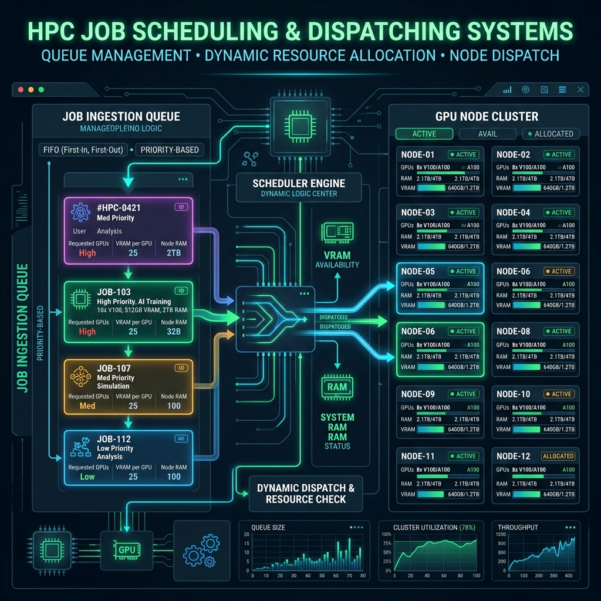

# Cluster Administration and Resilience Guide

This guide details the system administration tasks, architecture resilience features, and configuration requirements for managing the Cluster-CI infrastructure.

---

## 1. RunnerManager and Ephemeral Execution Slots

The GitHub Actions self-hosted runners are managed dynamically by the `RunnerManager` service (`src/scheduler/runner_manager.py`). This component coordinates standard execution slots alongside an exclusive administrative slot.

### Threaded Slots and Staggered Delay
The manager initiates a configured number of standard runner slots (`num_slots`) and one specialized `admin` runner slot. To prevent API rate-limiting and file lock collisions when registering multiple runners simultaneously, the startup of standard slots is staggered:
* Each slot experiences a staggered startup delay of `slot_id * 2` seconds before executing `./config.sh`.

### Provisioning Atomicity and Cleanup
* **Atomic Isolation**: When provisioning a runner folder, the manager copies the runner binaries from `runners/template` to a temporary directory before renaming it to the final slot destination atomically.
* **Configuration Reset**: Before launching the runner process, the manager forcefully cleans up stale state files (such as `.runner`, `.credentials`, etc.) to prevent "already configured" errors.

### Cancellation Loop Watchdog
Standard runners operate with the `--ephemeral` flag, processing exactly one job before exiting. To prevent runners from hanging indefinitely during cancellation cycles, the manager runs an active watchdog:
1. It scans the runner's diagnostic logs (`_diag/Runner_*.log`) every 10 seconds.
2. If it detects continuous job cancellation requests (specifically, 8 or more cancellation request lines in the last 15 lines of the log) OR if the registration becomes unauthorized, it increments a `cancellation_spam_count`.
3. Once the counter reaches 3, the manager kills the process (`process.kill()`) and instantly provisions a fresh runner slot to restore service.

---

## 2. System Prerequisites and Hardware Watchdog

For worker nodes to run reliably under heavy GPU training workloads on Grace Blackwell (GB10) architectures, low-level OS configurations must be properly set.

### Passwordless Sudoers Policy
The system relies on a dedicated sudoers drop-in configuration at `/etc/sudoers.d/cluster-ci`:
```text
$USER ALL=(ALL) NOPASSWD: /bin/systemctl restart cluster-runner-manager, /bin/systemctl restart cluster-scheduler, /bin/systemctl restart cluster-worker-agent, /usr/bin/dmesg, /usr/bin/journalctl
```
This enables the unprivileged cluster agent user to restart systemd services and read system telemetry logs without interactive password prompts.

### Systemd Hardware Recovery Watchdog
NVIDIA Grace Blackwell architectures can suffer from kernel panics or physical freezes when CUDA drivers crash under extreme memory allocation conditions. To prevent physical server hangs, systemd's hardware watchdog interface is configured in `/etc/systemd/system.conf`:
* `RuntimeWatchdogSec=30`: Directs systemd to ping the hardware watchdog device (e.g., `/dev/watchdog`) every 30 seconds. If the kernel freezes and systemd fails to "pet" the watchdog, the motherboard's hardware controller triggers a hard reboot of the machine.
* `RebootWatchdogSec=60`: Configures a 60-second watchdog timer during reboot sequences to recover from hangs at shutdown.

---

## 3. Maintenance Mode and Infrastructure Resilience

The headnode scheduler API provides a Maintenance Mode to allow administrators to perform upgrades or hardware maintenance without losing queued jobs.

### State Management and API Control
* **In-Memory Variable**: The active maintenance state is stored in an in-memory global variable (`MAINTENANCE_MODE = False`).
* **Endpoints**: Maintenance mode is toggled via:
  - `POST /maintenance/on`
  - `POST /maintenance/off`
* **Authorization**: Requests to these endpoints require Bearer token authorization using the `CLUSTER_TOKEN` environment variable.

### Job Suspension Behavior
When maintenance mode is enabled:
* The scheduler loop suspends worker assignments.
* Any call to the `/submit_job` endpoint is rejected.
* The API returns:
  `503 Service Unavailable` with body `{"error": "Service Unavailable: Maintenance Mode Active"}`.
  
This ensures researchers receive immediate feedback, and no new tasks enter the queue while workers are undergoing system updates.

### Critical Infrastructure Environment Variables
To ensure resilience, the scheduler and worker agents rely on several critical environment variables:
* `CLUSTER_TOKEN`: Bearer token used for authenticating administrative actions and API communications between workers and the headnode.
* `HEADNODE_URL`: The base URL of the headnode scheduler API (e.g., `http://10.0.0.1:5000`).
* `GC_FREE_SPACE_THRESHOLD_GB`: Minimum free disk space in GB on the worker before tiered garbage collection is triggered (defaults to 100).
* `DVC_VIEWER_TIMEOUT_MIN`: Idle timeout in minutes for DVC visualizer instances before they are automatically terminated (defaults to 30).

---

## 4. CI SSH Configuration

The GitHub Actions orchestrator needs access to the physical cluster headnode to submit jobs on behalf of researchers.

1.  The project administrator configures a dedicated SSH private key as a GitHub Repository Secret named `CLUSTER_SSH_PRIVATE_KEY`.
2.  This key matches the public key authorized on the cluster's headnode, allowing the GHA runner to execute `submit_job.py` and communicate with `/api/jobs` endpoint securely.

---

## 5. Passwordless Inter-Worker SSH (RSA Headless Setup)

To facilitate distributed computing and peer-to-peer (P2P) artifact sharing, the cluster workers require passwordless SSH communication between each other.

*   **Key Generation**: During worker provisioning, a standard RSA key pair without a passphrase is created:
    ```bash
    ssh-keygen -t rsa -b 4096 -f ~/.ssh/id_rsa -N ""
    ```
*   **Authorization Distribution**: The public key (`~/.ssh/id_rsa.pub`) of each worker must be appended to the `~/.ssh/authorized_keys` file of all other workers in the cluster.
*   **Host Key Verification**: To prevent interactive prompts blocking automated jobs, add the hostkeys or configure `StrictHostKeyChecking accept-new` in the worker configuration:
    ```text
    Host 10.0.0.*
        StrictHostKeyChecking accept-new
        IdentityFile ~/.ssh/id_rsa
    ```

---

## 6. Google Drive Authorization for DVC Storage

Cluster-CI uses Google Drive as a centralized remote storage for long-term DVC artifact caching. The credentials must be pre-authorized on each worker host so that headless Docker containers can pull/push artifacts without interactive OAuth prompts.

### Standard Headless Authorization Process:

1.  **Generate Credentials Locally**:
    On a machine with a web browser, initialize the Google Drive authentication flow:
    ```bash
    uv run dvc remote modify my_gdrive_remote auth gdrive
    ```
2.  **Perform OAuth Authentication**:
    DVC will display a link. Open this URL in your web browser, log in with your authorized institutional Google account, and grant the required permissions.
3.  **Retrieve Token**:
    Copy the authorization code from the browser and paste it back into the terminal. This creates a local token cache file containing the refresh token.
4.  **Deploy Credentials on Workers**:
    The resulting token must be deployed on each worker host via the `.env` / `.env.secrets` configuration files. The worker agents automatically mount these credentials at runtime, ensuring DVC commands (`dvc pull`, `dvc push`) run with full permissions inside containers.

---

## 7. Scheduling Queue and Job Dispatch Flow

Below is the schema outlining how jobs enter the execution queue, how placement constraints are evaluated by the scheduler, and how workers are allocated to execution slots.


