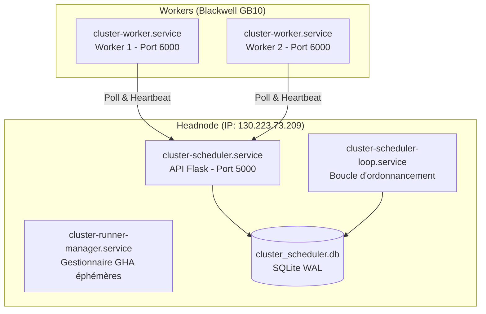

# Protocole de Déploiement et de Mise à jour du Cluster (Zéro Interruption)

## 1. Contexte & Problématique
Dans le cadre de l'exploitation de l'infrastructure du cluster NVIDIA Blackwell (Ubuntu 24.04), les modifications du code de l'orchestrateur `cluster-ci` doivent être déployées de manière fiable et maîtrisée. 

Afin d'éviter les perturbations induites par les déploiements automatiques à chaque push (ancien système GitOps opaque qui pouvait couper des jobs et compliquait le flux de développement), nous appliquons désormais une stratégie de **déploiement manuel contrôlé**. Ce document établit le protocole opérationnel pour effectuer les mises à jour sans interruption à l'aide du script `update_cluster.sh`.

---

## 2. Analyse de l'Architecture de Déploiement

L'orchestrateur `cluster-ci` est déployé sous forme de démons **systemd** s'exécutant dans l'espace utilisateur sur le Headnode et les Workers physiques.



### Détail des Services Installés

| Service Systemd | Rôle | Fichier Script | Machine |
|---|---|---|---|
| `cluster-scheduler.service` | API REST centrale du scheduler | `src/scheduler/headnode_service.py` | Headnode |
| `cluster-scheduler-loop.service` | Boucle périodique d'assignation des jobs | `src/scheduler/scheduler_loop.py` | Headnode |
| `cluster-runner-manager.service` | Manager des runners GitHub Actions éphémères | `src/scheduler/runner_manager.py` | Headnode |
| `cluster-worker.service` | Agent local du worker (Flask + boucle d'exécution) | `src/scheduler/worker_agent.py` | Chaque Worker |

---

## 3. Évaluation des Risques de Redémarrage

### A. Redémarrage des Services du Headnode (Scheduler)
> [!NOTE]
> **NIVEAU DE RISQUE : MINIME / SANS DANGER**
- **Impact technique** : Le redémarrage de l'API Flask (`cluster-scheduler`) coupe brièvement les requêtes pendant moins de 2 secondes. La base SQLite (WAL) garantit la cohérence.
- **Résilience** : L'agent worker dispose d'un mécanisme de retry robuste avec backoff exponentiel pour toutes ses requêtes.
- **Indépendance d'exécution** : Le runner GHA sur le worker tourne de façon autonome dans son conteneur Docker et dialogue directement avec GitHub Actions. Il n'est pas interrompu par un redémarrage temporaire du scheduler central.

### B. Redémarrage du Service Worker (`cluster-worker`)
> [!CAUTION]
> **NIVEAU DE RISQUE : CRITIQUE (Si effectué en cours de run)**
- **Impact technique** : Lors de l'arrêt du service `cluster-worker.service`, systemd envoie un signal `SIGTERM` au processus python `worker_agent.py`.
- **Comportement de nettoyage** : La méthode `cleanup_active_jobs_and_containers()` intercepte ce signal et nettoie l'état courant (VRAM, conteneurs, processus).
- **Précaution** : Il faut toujours s'assurer qu'aucun job n'est actif sur un worker avant de le mettre à jour.

---

## 4. Stratégie de Déploiement Manuel (Recommandée)

Pour garantir une stabilité absolue et un contrôle total sur l'infrastructure, nous utilisons le script local `update_cluster.sh`. Cela élimine les effets de boîte noire des mises à jour automatiques à chaque commit.

Le déploiement se déroule en trois étapes :
1. **Validation locale** des modifications de code.
2. **Push des modifications** sur la branche `main` de GitHub.
3. **Exécution du script** `./update_cluster.sh` depuis votre machine locale ou le headnode.

---

## 5. Protocole Opérationnel

Pour appliquer une mise à jour de façon sécurisée, suivez la séquence d'actions ci-dessous.

### Étape 1 : Validation de l'état du cluster
Avant de lancer le déploiement, vérifiez sur le tableau de bord ou via les logs qu'aucun job n'est en cours d'exécution.

### Étape 2 : Push du code sur GitHub
Poussez vos commits validés sur la branche `main` du dépôt public `UNIL-DESI/cluster-ci`.

### Étape 3 : Exécution du script de mise à jour
Exécutez le script à la racine du projet :

```bash
./update_cluster.sh
```

Ce script va automatiquement :
- Se connecter en SSH au Headnode et exécuter la procédure d'installation/mise à jour à chaud.
- Mettre à jour `dvc-viewer` globalement sur le Headnode.
- Se connecter à chaque Worker répertorié dans le fichier `.env` pour mettre à jour l'agent et recharger les conteneurs de base Docker.
- Lancer un test d'intégration en soumettant deux jobs de test pour valider que tout le cluster est pleinement opérationnel.

---

## 6. Synthèse des Bénéfices de l'Approche Manuelle

| Critère | Ancienne Approche GitOps Automatique | Nouvelle Approche Manuelle Contrôlée |
|---|---|---|
| **Contrôle du Timing** | ❌ Opaque (Mise à jour immédiate à chaque push, risque de coupure de job en cours) | **Total** (Mise à jour décidée par l'opérateur au moment opportun) |
| **Simplicité** | ❌ Complexe (Dépendance d'un workflow GHA autonome et de webhooks d'auto-update) | **Maximale** (Un seul script `./update_cluster.sh` gère tout de bout en bout) |
| **Robustesse matérielle** | ❌ Moyenne (Risque de boucles de crash et de blocages de redémarrage automatique) | **Excellente** (Le script valide l'intégrité du cluster avec 2 jobs de test à la fin) |
