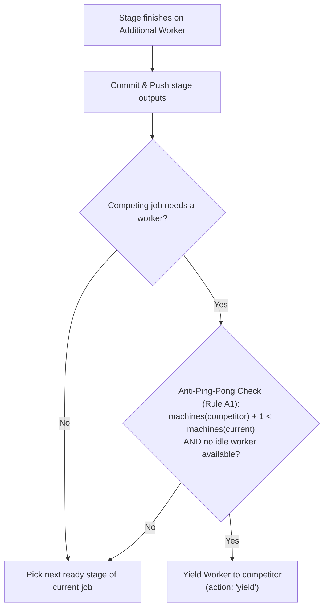

# CI Pipeline & Queue Scheduling Guide

When you run `cluster-run`, your job enters a queue and is automatically assigned to available GPU and CPU workers. This guide explains how jobs and DAG stages are scheduled, how multi-machine fairness is enforced, and what hardware admission rules apply.

---

## 1. Job Lifecycle

When you trigger a run using `cluster-run`, your job proceeds through the following lifecycle:

1.  **Submission**: Your code is pushed to GitHub, which notifies the headnode orchestrator.
2.  **Queue & Graph Analysis**: 
    * In classic mode, the job enters a FIFO queue.
    * In parallel mode (`PARALLEL_STAGES=true`), the scheduler analyzes `dvc.yaml` and Git history to determine ready vs skipped nodes.
3.  **Scheduling**: Every 5 seconds, the scheduler evaluates pending jobs/nodes against active worker capacities.
4.  **Execution**: Assigned workers boot execution containers, mount repository worktrees, pull required dependencies, and run either the full pipeline (`dvc repro`) or targeted stages (`dvc repro -s <node>`).
5.  **Results & Sync**: Metrics, plots, and `dvc.lock` updates are committed back to your branch, and heavy artifacts remain cached across workers.

---

## 2. Resource Admission Rules

Each worker node automatically reports its hardware telemetry to the headnode upon startup (CPU cores, RAM, VRAM per GPU, unified memory flag, architecture, and free disk space).

When scheduling a job or individual stage, the scheduler compares requested resources against worker specifications:

| Worker Architecture | Memory Admission Rule | GPU Allocation |
| :--- | :--- | :--- |
| **Unified Memory** *(e.g. Grace Blackwell GB10, 128 GB)* | `ram_gb + vram_gb <= total_ram_gb - 8.0 GB` *(Shared pool minus 8 GB OS reserve)* | Native unified GPU access |
| **Discrete GPU & RAM** *(e.g. isipol09, 2× RTX 3090)* | `ram_gb <= available_ram_gb - 8.0 GB` **and** `vram_gb <= sum(available_vram[gpu_ids])` | Specific GPUs isolated via `CUDA_VISIBLE_DEVICES` |
| **All Workers** | `cpus <= available_cpus` `storage_gb <= available_disk_gb` Docker image matches worker architecture | — |

<!-- v3: à vérifier contre l'implémentation : variables d'environnement CUDA_VISIBLE_DEVICES et formule exacte de réserve OS -->

### Default Resource Allocation
If resources are not explicitly specified in `meta.cluster` or `.cluster-ci`:
* **RAM**: Defaults to **10 GB** (workers reserve 8 GB for OS operations).
* **VRAM**: Defaults to **0 GB** (runs on CPU or GPU nodes).
* **CPU**: Defaults to **4 cores**.
* **Storage**: Defaults to **0 GB** (no disk enforcement).

---

## 3. Scheduling Models: Classic vs Parallel DAG

Cluster-CI supports two scheduling modes depending on the `PARALLEL_STAGES` configuration in `.cluster-ci`:

### A. Classic Mode (`PARALLEL_STAGES=false` or omitted)
* **Single-Worker Assignment**: One job occupies at most one machine.
* **Sequential Repro**: The assigned worker runs `dvc repro` from start to finish.
* **Queue Discipline**: Strict FIFO with branch exclusivity.

### B. Parallel DAG Mode (`PARALLEL_STAGES=true`)
* **Multi-Worker Scaling**: A single job can scale across multiple machines (up to 8 workers) to run independent DAG branches concurrently.
* **Granular Stage Scheduling**: Stages are assigned individually as soon as their parents complete.
* See the [Parallel DAG Execution Guide](parallel_execution.md) for architecture details.

---

## 4. Multi-Machine Fair-Share Scheduling (v3)

In parallel mode, Cluster-CI enforces an equitable resource-sharing algorithm across researchers.

### Home Worker (Guaranteed Machine)
* When a parallel job starts, the scheduler assigns it a **Home Worker** (primary machine) in FIFO arrival order.
* **Strict Invariant**: The home worker is **never revoked** while the job has active or pending work.
* If all current stages are blocked waiting for inputs, the home worker waits (`action: "wait"`) and keeps its container ready.

### Additional Workers (Opportunistic Bursting)
* If additional workers are idle and a job has multiple ready stages in its DAG, the job can acquire extra workers.
* Up to 8 workers can execute stages for the same job simultaneously.

### Fair-Share Rebalancing at Node Boundaries
To prevent one large pipeline from monopolizing the entire cluster, machines are dynamically rebalanced at stage completion boundaries:

1. **Anti-Ping-Pong Rule (Rule A1)**:
   An additional worker is yielded to a competing job only if:
   * The competitor has an admissible ready node;
   * `machines(competitor) + 1 < machines(current)` (i.e. `machines(competitor) < machines(current) - 1`);
   * No other idle worker in the cluster can accommodate the competitor.
   
   *Example*: If Job A holds 2 machines and Job B holds 1 machine, Job A does **not** yield (because 1 + 1 is not < 2). If Job A holds 2 machines and Job B holds 0 machines, Job A yields its additional machine to Job B.

2. **Classic Job Priority (Rule A2)**:
   A classic sequential job waiting in the queue counts as a competitor with 0 machines requesting 1 machine. Additional workers from parallel jobs are yielded to classic jobs at stage boundaries.

3. **No Ready Node Behavior (Rule A3)**:
   * **Home Worker**: If no node is ready, it waits (`action: "wait"`).
   * **Additional Worker**: If no node is ready, it yields immediately (`action: "yield"`), ensuring no idle workers are hoarded.

4. **Zero Preemption**:
   **No running stage is ever interrupted or killed** to yield resources. Rebalancing occurs strictly when a stage completes and its outputs are committed.

---

## 5. Worker Selection & Data Locality

When multiple eligible workers can execute a ready stage, the scheduler selects the worker with highest priority:
1. **Continuation Priority**: Prefers assigning a child stage to the worker that just finished its parent (reusing the warm container and local cache).
2. **Data Locality Score**: Ranks workers based on existing local DVC cached files (`dep_paths`).
3. **Cluster Topology Penalty**: Applies a slight penalty (-1) to the headnode to reserve it for scheduling and lightweight management.

---

## 6. Runtime Limits & Auto-Cancellation

### Timeout Watchdog
Every job must specify `MAX_RUNTIME_HOURS` in its `.cluster-ci` file (maximum: 24 hours). If your job exceeds this limit, it is automatically terminated.

### Dashboard Cancellation
You can cancel an active job from the [Dashboard](dashboard.md) by clicking **Stop**. All assigned workers release their containers and reclaim GPU memory within seconds.

### Auto-Cancellation on New Submissions
* **Draft Branches (`cluster-draft/*`)**: Only one active run per researcher. Pushing a new run cancels earlier pending or running executions.
* **Standard Branches (`main`, `feature/*`)**: Pushing a new commit cancels older **pending** jobs on that branch, while running jobs are allowed to complete.
