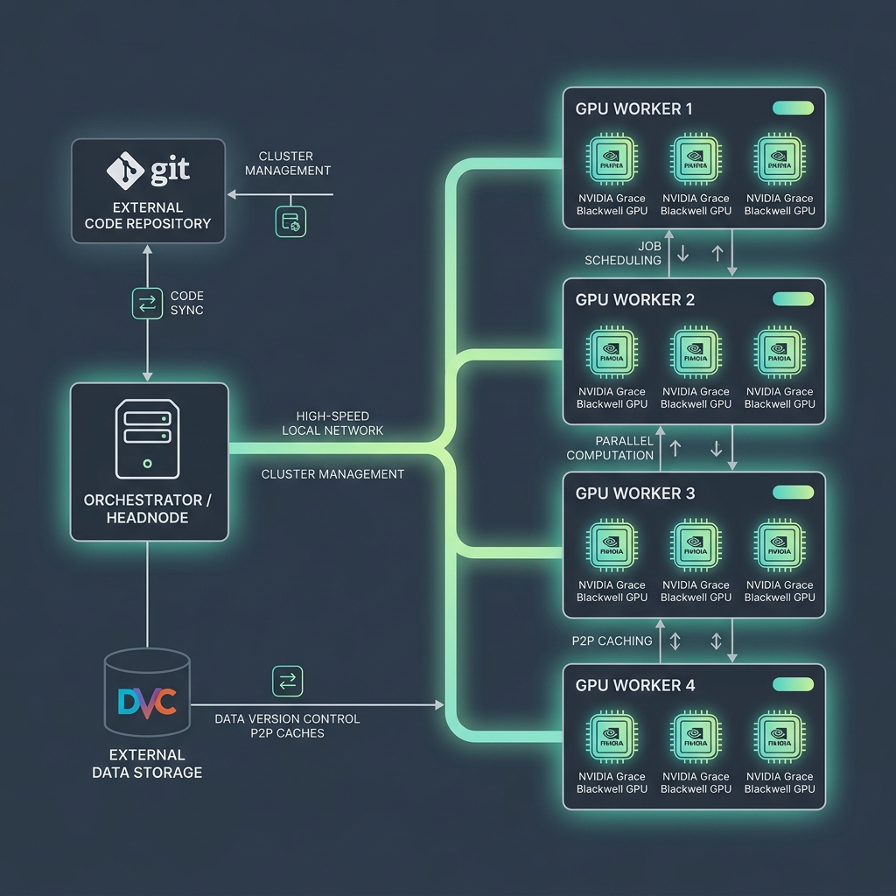

# Docker Containers & Compute Environments

Cluster-CI runs all pipeline jobs inside Docker containers to guarantee isolation, reproducibility, and JIT environment cleanup. This guide details how the container runtime is configured, what pre-installed environments are available, and how to customize them for heavy training libraries like **Unsloth** or specific **PyTorch** versions.

---

## 1. The "Golden Image" (NVIDIA NGC PyTorch)

To avoid compiling heavy compute packages (like PyTorch, torchvision, or CUDA kernels) during job execution—which is slow on x86_64 and often fails on ARM64 workers—the cluster defaults to a pre-compiled, highly optimized **"Golden Image"**.



*   **Default Image**: `nvcr.io/nvidia/pytorch:26.05-py3`
*   **Software Stack**:
    *   **Python**: 3.12
    *   **PyTorch**: 2.12+ (NVIDIA build)
    *   **CUDA**: 13.2
    *   **Libraries**: Includes NVIDIA TensorRT, cuDNN, NCCL, and optimized mathematical libraries out of the box.

### Dynamic Dependency Injection
When a job starts, the orchestrator bypasses standard virtual environments (`.venv`) and installs the dependencies listed in your `pyproject.toml` directly into the container's system Python using `uv pip install --system`. 

This ensures your custom packages (like `tqdm`, `transformers`, or `pandas`) run directly on top of the pre-optimized NVIDIA PyTorch binary.

### Composite Dependency Hashing
The `src/runner/smart_install.sh` shell script implements a **Composite Dependency Hashing** mechanism to speed up container launch times by skipping redundant dependency installations.

1.  **Hash Calculation**: The function `compute_deps_hash()` aggregates all files defining Python project dependencies: `pyproject.toml`, `uv.lock` (if present), `requirements.txt` (if present), and `setup.py` (if present). It computes a composite MD5 hash:
    `md5sum $files 2>/dev/null | md5sum | cut -d' ' -f1`
2.  **State Verification**: The resulting hash is compared against the value stored in the persistent Docker home volume at `/home/user/.cluster-ci-deps-hash`.
3.  **Sanity Check Bypass**: If the current and cached hashes match, the script performs a quick sanity check to verify that Python packages are actually installed by looking for `.dist-info` directories in `/home/user/.local/lib/python3.*/site-packages` or `dist-packages`. If the sanity check passes, it exits with `0`, bypassing the installation entirely. If packages are missing, it deletes the hash file and triggers a full dependency install.

!!! note "Internal Details"
    The container runtime also includes protective mechanisms (NGC Library Shadowing Protection, vLLM NVSHMEM Stub Symlinking, bitsandbytes CUDA Compatibility Patch) that run transparently. For technical details, see the [Infrastructure Internals](../admin/infrastructure_internals.md#3-container-hardening) documentation.

---

## 2. Overriding the Docker Image in `.cluster-ci`

If your project requires a different base environment, or a specific pre-built image (e.g. for a specific version of a framework), you can override the Docker settings directly in the `.cluster-ci` file at the root of your repository.

The platform is **architecture-aware** and allows both global and per-architecture overrides:

```ini
# Global overrides (applies to both AMD64 and ARM64 workers)
DOCKER_IMAGE=my-custom-registry/my-project-image:latest
DOCKER_PLATFORM=linux/arm64
DOCKER_FLAGS=--env-file=custom.env

# Architecture-specific overrides (takes priority on matching workers)
DOCKER_IMAGE_ARM64=nvcr.io/nvidia/pytorch:26.05-py3
DOCKER_IMAGE_AMD64=my-custom-registry/my-project-image-amd64:latest

DOCKER_PLATFORM_ARM64=linux/arm64
DOCKER_PLATFORM_AMD64=linux/amd64

DOCKER_FLAGS_ARM64=--cap-add=SYS_NICE
DOCKER_FLAGS_AMD64=--shm-size=16g
```

### Supported Parameters

| Parameter | Description |
| :--- | :--- |
| `DOCKER_IMAGE` / `_ARM64` / `_AMD64` | The Docker image tag to pull and run. |
| `DOCKER_PLATFORM` / `_ARM64` / `_AMD64` | Injects the `--platform` flag (e.g. `linux/arm64` or `linux/amd64`). |
| `DOCKER_FLAGS` / `_ARM64` / `_AMD64` | Arbitrary flags passed directly to `docker run` (e.g., capability flags, custom mounts). |

---

## 3. Unsloth & LLM Fine-Tuning Setup

[Unsloth](https://github.com/unslothai/unsloth) is a popular library for accelerating LLM fine-tuning (up to 2x faster, 70% less memory). However, it has strict installation requirements: it must match specific versions of PyTorch, Triton, and CUDA, and compiling it from source on ARM64 workers (Blackwell) can be difficult.

### Recommended Approach
To use Unsloth on the cluster, we recommend using a **custom pre-built Docker image** rather than installing it JIT via `pyproject.toml`.

1.  **Build a custom Docker image** inheriting from the NVIDIA PyTorch NGC container:
    ```dockerfile
    FROM nvcr.io/nvidia/pytorch:26.05-py3

    # Install Unsloth dependencies
    RUN pip install --no-cache-dir "unsloth[colab-new] @ git+https://github.com/unslothai/unsloth.git"
    RUN pip install --no-cache-dir --no-deps xformers "trl<0.9.0" peft accelerate datasets
    ```
2.  **Push the image** to your registry (e.g. GitHub Container Registry).
3.  **Configure `.cluster-ci`** in your repository to use this custom image:
    ```ini
    REQUIRED_RAM=24GB
    REQUIRED_VRAM=24GB
    MAX_RUNTIME_HOURS=12
    DOCKER_IMAGE=ghcr.io/your-org/unsloth-custom:latest
    ```

---

## 4. Shared Memory & Data Loader Optimizations

PyTorch `DataLoader` workers use shared memory (`/dev/shm`) to pass tensors between processes. By default, Docker allocates only **64 MB** of shared memory, which causes PyTorch to crash with a bus error (`SIGBUS`) when using `num_workers > 0`.

### Platform Defaults
To solve this, Cluster-CI **automatically injects** the following configurations for all containers:
*   `--ipc=host`: This mounts the host's IPC namespace inside the container.
*   This grants the container access to **50% of the host physical memory** as shared memory `/dev/shm`.
*   **Note**: Legacy `.cluster-ci` options like `SHARED_MEMORY` are obsolete and ignored, as `--ipc=host` solves this issue natively and safely.
