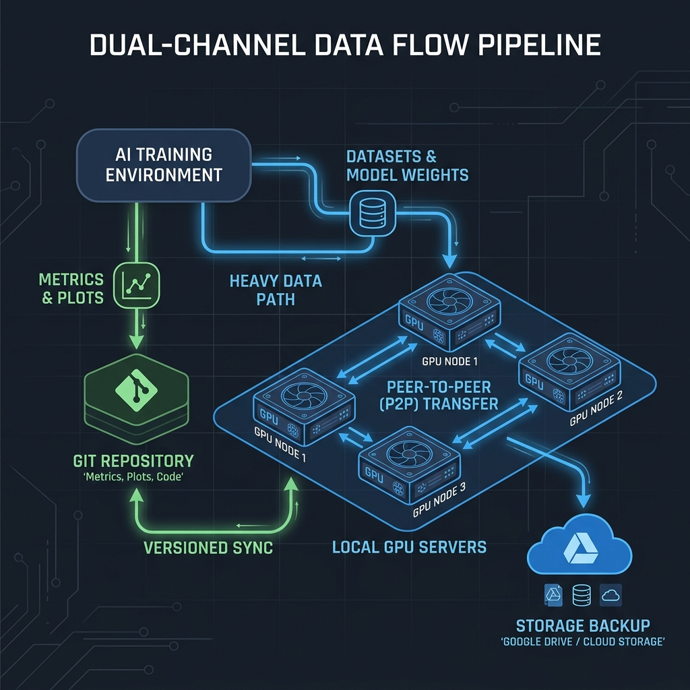

# DVC, Storage, and Data Locality Guide

Data Version Control (DVC) is integrated into Cluster-CI to manage large datasets and models, while standard Git is reserved for code, metrics, and analytical plots. This guide explains how to define your pipelines and how data flows through the cluster.

---

## 1. High-Level Data Flow

Cluster-CI employs a dual-channel architecture to handle experiment files. Depending on how you declare a file in `dvc.yaml`, it will take one of two paths:



```
                  +--------------------------------+
                  |           dvc.yaml             |
                  +--------------------------------+
                     /                          \
       outs: or deps:                            metrics: or plots:
      (Large data, models)                      (JSON, CSV, PNG, SVGs)
           /                                              \
  DVC CAS Cache (Worker)                            cache: false
           |                                              |
    [P2P Transfer]                                  [Git Sync]
  HTTP /fetch_artifact                             Immediate push by
  between workers                                   cluster-ci-bot
           |                                              |
[gc_orchestrator.py GC]                             [Local Pull]
 Pushes to Google Drive                             git pull --rebase
   only if disk < 100GB                               to local repo
```

---

## 2. Defining Pipelines in `dvc.yaml`

To run experiments on the cluster, you must define a pipeline using a `dvc.yaml` file at the root of your repository. 

### Pipeline DAG Example
The following pipeline processes a raw dataset and trains a neural network model:
```yaml
stages:
  process_dataset:
    cmd: python3 src/preprocess.py --input data/raw.csv --output data/clean.csv
    deps:
      - src/preprocess.py
      - data/raw.csv
    outs:
      - data/clean.csv

  train:
    cmd: python3 src/train.py --input data/clean.csv --model models/model.pt --metrics reports/eval.json --plot reports/loss.png
    deps:
      - src/train.py
      - data/clean.csv
    outs:
      - models/model.pt
    metrics:
      - reports/eval.json: {cache: false}
    plots:
      - reports/loss.png: {cache: false}
```

### Sequential Execution (DAG Topological Repro)
Cluster-CI does not run a simple `dvc repro`. To optimize executions and provide real-time updates:
1.  The runner executes `dvc_iterative_repro.py`, which parses your pipeline and builds the execution Directed Acyclic Graph (DAG) using `dvc dag --dot`.
2.  It calculates a topological sort of the stages.
3.  It runs each stage individually using `dvc repro <stage_name> -s` (`--single-item`). The `-s` flag prevents DVC from verifying or rebuilding upstream dependencies, because they have already been processed in the correct topological order.
4.  At the start of each stage, it updates `.dvc/tmp/iterative-status.json` so that the Web Dashboard can display live stage-by-stage status.

---

## 3. Comparison: DVC CAS vs. Git Sync

Understanding the difference between these two tracks is crucial to prevent jobs from failing or bloating your repository.

| Feature | Large Artifacts (`outs` / `deps`) | Small Analytical Data (`metrics` / `plots`) |
| :--- | :--- | :--- |
| **Typical Files** | Datasets, features, weights (`.pt`, `.safetensors`, `.h5`) | Training curves, performance JSONs, PNG graphs |
| **Storage Backend** | Worker Local Disk Cache (Content Addressable Storage) | Remote Git Repository (`origin` branch) |
| **Transport Protocol** | Peer-to-Peer HTTP transfers (`/fetch_artifact` on port 6000) | Git push/pull over HTTPS/SSH |
| **Synchronization** | Pulled on-demand by workers during scheduling | Committed immediately after **each stage** completes |
| **Size Limit** | Up to several gigabytes (subject to worker disk space) | **Strictly < 5 Megabytes** |
| **Auto-Cleanup** | Garbage collected by `gc_orchestrator.py` when disk < 100GB | Retained permanently in Git history |

---

## 4. Large Artifacts (`outs` / `deps`) & P2P Data Plane

When you declare a file in `outs:`, it is stored in the local DVC cache of the worker that executed the job. It is **not** immediately pushed to Google Drive, which saves external network bandwidth.

### Local Cache Checking (Scoring)
When a new job is submitted:
1.  The headnode parses the repository's `dvc.lock` and extracts all expected DVC MD5 hashes.
2.  It contacts all online workers via their `/check_cache` endpoint, checking which worker already has these files in their local directory.
3.  The scheduler awards the job to the worker with the highest number of cache hits (data locality scheduling).

### Peer-to-Peer (P2P) Pulling
If the winning worker lacks some of the dependencies, but another worker possesses them:
1.  The scheduler identifies the best peer worker.
2.  It injects a `DVC_REMOTE_P2P_URL` environment variable containing the peer worker's `/fetch_artifact` address.
3.  The executing worker adds a temporary DVC remote:
    ```bash
    dvc remote add -f peer_remote http://<peer_worker_ip>:6000/fetch_artifact/
    dvc pull --allow-missing -r peer_remote
    ```
4.  This transfers files directly over the internal high-speed network.

### Just-In-Time (JIT) Tiered LRU Garbage Collection
To prevent worker hard drives from filling up, the runner executes a JIT cleanup routine managed by `gc_orchestrator.py` before and after each job run.

*   **Safety Threshold**: The safety threshold is set to **100 GB** (configured via `GC_FREE_SPACE_THRESHOLD_GB` on the worker host).
*   **LRU Registry**: The system maintains a metadata registry (`repositories/registry.json`) tracking project usage (active/idle status, last execution timestamp, and disk size).
*   **Trigger**: If the free space on the partition drops below 100 GB when starting a job, the GC selects the oldest `idle` repositories and applies a **5-level progressive purge** (Least Recently Used first) until the threshold is restored.

#### Progressive Cleanup Levels
The garbage collector frees space in five progressive steps:

| Level | Target | Action & Recovery |
| :--- | :--- | :--- |
| **Level 1** | **DVC History Purge** | Purges historical DVC files in the local cache, preserving only the **last 2 commits** of the repository. |
| **Level 2** | **Large Untracked Files** | Force-deletes any untracked or ignored files in the workspace that are **larger than 500 MB**. |
| **Level 3** | **Docker Dependency Volume** | Deletes the project-specific Docker volume (`cluster-ci-home-<owner-repo>`), clearing cached `uv` and `pip` installations. They will be re-downloaded/reinstalled during the next run. |
| **Level 4** | **Local DVC Cache Wipe** | Wipes the entire local `.dvc/cache` directory. Before wiping, the GC pushes dirty/idle caches to the central backup (Google Drive). The next run will pull them back over the LAN or GDrive. |
| **Level 5** | **Full Repository Wipe** | Deletes the entire repository directory (`repositories/<owner-repo>`) from the worker. |

Active repositories currently running jobs are **never** targeted by the GC.

### Emergency Garbage Collection (50 GB Threshold)
The worker node implements an automatic, destructive **Emergency Garbage Collection** loop within `src/runner/gc_orchestrator.py` designed to prevent disk space exhaustion.

1.  **Triggering and Panic Threshold**: The emergency GC is launched via `run_gc()`. It checks the free space of the storage partition where repositories reside (derived using `shutil.disk_usage`). The panic threshold is set to a hardcoded limit of **50 GB** (`PANIC_THRESHOLD_GB = 50`).
2.  **Resource Pruning**: Before deleting workspace directories, the script executes a general Docker system cleanup by calling `docker system prune -f` to reclaim space from dangling images, unused networks, and stopped containers.
3.  **Workspace Eviction Strategy (FIFO/LRU)**: If the storage space remains below 50 GB after the Docker prune, the script parses the `registry.json` database. It filters out all projects marked as `status: "idle"`. It then sorts these idle projects chronologically by their `last_execution` timestamp, placing the least recently used (LRU) project at the front.
4.  **Destructive Cleanup**: For each candidate project, the GC invokes `cleanup_level_5(project_path, project_name)`, which executes a recursive directory deletion via `shutil.rmtree(project_path)`. No remote backups or DVC pushes are executed during this emergency routine.
5.  **Termination Condition**: The deletion loop stops immediately once the available disk space climbs back above the 50 GB limit. The database `registry.json` is updated, writing `status: "deleted"` and `size_bytes: 0` for all evicted projects.

### Lazy Workspace Transfer (`sync_status`)
For standard maintenance, `src/runner/gc_orchestrator.py` implements a **Lazy Workspace Transfer** routine through `run_transfer_gc()` to offload older workspace folders.

1.  **Threshold and Scan**: Triggered when the worker's free disk space drops below `FREE_SPACE_THRESHOLD_GB` (defaults to 100 GB, configurable via the `GC_FREE_SPACE_THRESHOLD_GB` environment variable). The orchestrator identifies candidate projects marked as `"idle"`.
2.  **DVC Remote Verification**: The worker inspects the workspace configuration at `.dvc/config`. If a remote is configured (determined by searching for the `remote =` string), the project cannot be deleted without pushing its data.
3.  **Headnode Query & Push**: The worker queries the central headnode API endpoint (`HEADNODE_URL/check_space`) to check if the remote repository has sufficient storage capacity. If the headnode is available and has enough space, the worker executes a local `dvc push` inside the project path.
4.  **Eviction & Sync Status Update**:
    *   If the `dvc push` succeeds, the project is evicted from the worker via `cleanup_level_5` (workspace directory deleted). The project status in `registry.json` is set to `"deleted"`, its size is set to `0`, and its `sync_status` is updated to `"done"`.
    *   If the headnode is unreachable, full, or if the `dvc push` fails, the local workspace deletion is deferred. The project's `sync_status` is set to `"pending"` in the registry, ensuring it is kept locally until the next maintenance pass.
    *   If the workspace has no DVC remote configured, it is directly evicted and marked as `status: "deleted"` and `sync_status: "done"`.

### Historical DVC Visualizer
The historical visualizer allows researchers to view pipeline DAGs, metrics, and plots for older revisions without interfering with the active workspace. It utilizes isolated Git worktrees and cached symlinks.

1.  **Git Worktree Isolation**: When a historical view request is sent to the headnode for a repository at a specific commit revision, the worker API endpoint `/api/worker/dvc-viewer/start` (in `src/scheduler/worker_agent.py`) is invoked. It creates a deterministic directory in `/tmp/dvc-viewer-<repo>-<rev_short>` and executes:
    `git worktree add --detach <worktree_dir> <target_rev>`
    This checks out the specified commit in an isolated directory without affecting the worker's main branch workspace.
2.  **Local DVC Cache Symlinking**: To avoid time-consuming network pulls, the worker creates a `.dvc` folder inside the newly created worktree, symlinks the main repository's DVC cache (`repo_path/.dvc/cache` -> `worktree_dir/.dvc/cache`) and copies the `config` and `config.local` configuration files. It then runs:
    `dvc checkout`
    This restores all heavy outputs instantly from the shared local DVC cache, without making network requests.
3.  **Inactivity Heartbeats**: The `dvc-viewer` server (launched in `dvc_viewer/server.py`) spawns a background thread named `_inactivity_daemon`. This daemon monitors server activity. If no client requests hit the `/api/heartbeat` endpoint for 15 consecutive seconds, the server self-destructs by calling `os._exit(0)`. While the user's browser is active, it pings the proxy on the headnode every 5 seconds, which forwards the heartbeat to the worker to keep the instance alive.
4.  **Headnode Cleaning Task**: In `src/scheduler/headnode_service.py`, a background thread `cleanup_inactive_viewers()` runs every 30 seconds:
    *   For **local** viewers: if the last access exceeds `DVC_VIEWER_TIMEOUT_MIN` (defaults to 30 minutes), it terminates the process (`proc.terminate()`).
    *   For **remote** worker viewers: if the last access is older than 45 seconds (since the worker itself terminates after 15 seconds of inactivity), the headnode prunes the metadata registration entry.

---

## 5. Metrics & Plots (`metrics` / `plots`) & Git Sync

Metrics and plots are lightweight files used to evaluate models. They must be committed to the Git repository to keep track of performance.

### Automatic Cache Deactivation
The runner automatically runs `dvc_git_helper.py inject` before the pipeline starts. This script parses `dvc.yaml` and forces `'cache': false` on all declared metrics and plots. Even if you forget to write `{cache: false}`, the platform enforces it automatically.

### Post-Stage Commits
Immediately after **each** pipeline stage completes (or if a stage **fails** to preserve logs and crash states):
1.  The runner scans the files listed in `metrics` and `plots`.
2.  **Size Guard**:
    - If a file is **under 5 MB**, it stages it using `git add -f <path>` (which bypasses any `.gitignore` rules).
    - If a file is **5 MB or larger**, the runner ignores it, does not push it, and prints a warning:
      `⚠️ WARNING: File <path> exceeds the 5 MB limit. It will not be synchronized.`
3.  It commits the staged files with the author name `cluster-ci-bot` (`bot@cluster-ci.io`) and the commit message directive `[skip ci]`.
4.  It pushes the commit to your branch. If the push fails because another job pushed changes first, the runner executes `git pull --rebase origin HEAD` to merge the changes automatically and then pushes.

---

## 6. How to Retrieve Results Locally

Because the cluster runner automatically pushes commits to your branch during execution, your local Git history will become outdated.

To retrieve DVC locks, metrics, and plots:
1.  Open your terminal in your local repository.
2.  Run a rebase pull to download the commits generated by `cluster-ci-bot`:
    ```bash
    git pull --rebase origin <your-branch-name>
    ```
3.  If you have local modifications, stash them first:
    ```bash
    git stash
    git pull --rebase origin <your-branch-name>
    git stash pop
    ```
4.  To pull heavy outputs (e.g. models) that were stored in the DVC cache (if you are on the same worker or after GC pushed to Google Drive):
    ```bash
    dvc pull
    ```
