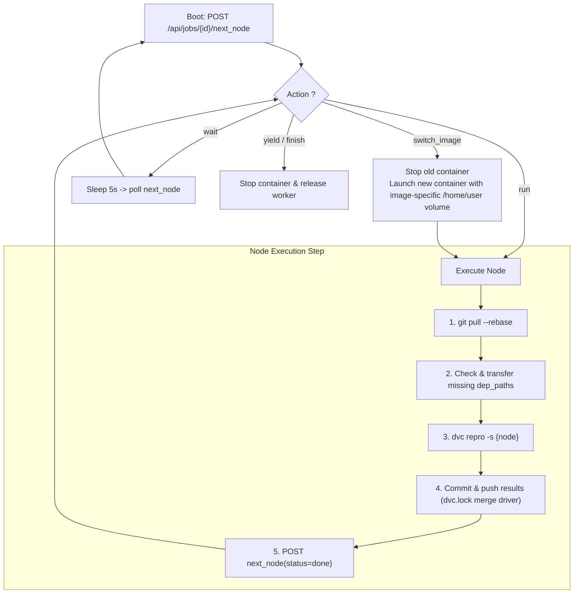

# Parallel DAG Execution

Cluster-CI v3 enables distributed, parallel stage execution across multiple cluster workers directly from your DVC pipeline DAG. Instead of running an entire pipeline sequentially on a single node, independent branches execute concurrently across available cluster machines.

---

## 1. Enabling Parallel Execution

Parallel stage execution is opt-in and controlled via your `.cluster-ci` configuration file.

To enable parallel DAG scheduling, add the following flag to `.cluster-ci`:

```ini
# Enable parallel DAG scheduling across workers
PARALLEL_STAGES=true
```

When `PARALLEL_STAGES=true` is set:
* The submission engine parses your `dvc.yaml` pipeline and builds an execution graph.
* Multiple branch executors across the cluster can claim independent ready stages concurrently.
* If omitted or set to `false`, Cluster-CI runs in legacy sequential mode (one machine per job, running `dvc repro`).

---

## 2. Pipeline Analysis and Stale Node Detection

Before dispatching tasks, the Cluster-CI v3 planner determines which nodes must be executed:

```
[Repository Push] 
       │
       ▼
[Planner: Git Analysis] 
       │
       ├─► Read dvc.yaml & resolve foreach stages
       ├─► Inspect dvc.lock, code diffs, parameters
       └─► Flag 'stale' nodes (code, param, or upstream changed)
       │
       ▼
[Headnode: DAG State Engine]
       └─► Ready queue populated (nodes whose parents are done/skipped)
```

1. **Pure Git Analysis**: The planner evaluates changed stage code, parameter files, and `dvc.lock` hashes **strictly from Git history**. No heavy datasets or DVC cache downloads are required on the headnode.
2. **Dynamic Pruning**: Up-to-date stages with matching dependency hashes are marked as `skipped` at submission time.
3. **DAG Dependency Tracking**: As soon as all parent stages of a node reach `done` or `skipped`, the child node automatically transitions to `ready`.

---

## 3. Branch Executor Lifecycle

Each participating worker runs a dedicated **Branch Executor** managing the containerized execution environment.



### Persistent Containers & Image Switching
* **Long-Lived Container**: On each assigned worker, the container remains active between consecutive stages to avoid container startup and teardown latency.
* **Dynamic Image Switching**: When the next assigned node requires a different Docker image (`meta.cluster.image`), the executor stops the previous container and starts the new one.
* **Isolated Per-Image Home Volumes**: Docker named volumes are isolated per image and repository (`cluster-ci-home-${REPO_SLUG}-${IMAGE_SLUG}`) and mounted onto `/home/user`. This preserves package caches (`uv`, wheels, huggingface caches) while preventing binary ABI incompatibilities between different Linux distributions or Python versions.

---

## 4. Git Synchronization and Merge Driver

Because multiple workers execute nodes of the same branch simultaneously, Git synchronization is automated to avoid lock file collisions.

1. **Pre-Execution Pull**: Before running a stage, the executor performs a `git pull --rebase origin {branch}` to pull upstream changes committed by parallel workers.
2. **Single-Stage Repro**: The worker executes only the designated stage:
   ```bash
   dvc repro -s <stage_name>
   ```
3. **Atomic Commit & Resilient Push**: Stage metrics, plots, and updated stage sections in `dvc.lock` are committed with retry mechanisms:
   <!-- v3: à vérifier contre l'implémentation : module dvc_git_helper et drapeaux de retry -->
   * If a concurrent worker pushed in the meantime, the executor rebases with exponential backoff.
4. **Automated `dvc.lock` Merge Driver**: Cluster-CI registers a specialized merge driver in `.git/info/attributes` for `dvc.lock`. When two branches or nodes finish simultaneously, stage outputs in `dvc.lock` are unioned cleanly per stage without generating merge conflicts.

---

## 5. Heavy Artifact Handling (No Centralization)

Heavy model weights and datasets tracked by DVC are **never centralized** onto the headnode or pushed to intermediate Git commits.

### Data Locality
* When scheduling a ready node, the scheduler evaluates data locality: it prefers placing the node on a worker that already has the required `dep_paths` locally cached from previous stages or past runs.

### Peer-to-Peer Artifact Fetching
* If a node is scheduled on a worker missing certain dependency files, the worker fetches them directly from the peer worker that produced them (`/fetch_artifact` P2P transfer).

### Resilient Recovery on Purged Artifacts
* If an input artifact was purged by the local garbage collector on all machines, the worker reports:
  <!-- v3: à vérifier contre l'implémentation : structure exacte du statut missing_deps -->
  ```json
  { "status": "missing_deps", "missing_paths": ["data/features.parquet"] }
  ```
* **Automatic Producer Rerun**: The headnode automatically resets the producer node back to `ready` with reason `outputs_missing`. The downstream node returns to `pending` until the producer re-generates the output.
* **Safety Guard**: Cluster-CI allows at most 1 forced replay per producer node per job to prevent infinite rerun loops.

---

## 6. Aggregated Real-Time Logging

When multiple stages run across distinct machines in parallel, their logs are unified and multiplexed.

Every log line emitted by an executor container is tagged with its stage name and worker hostname:

```text
[preprocess@HEC45801] Processing batch 1/50...
[eval_baseline@HEC45803] Loaded checkpoint models/baseline.pt
[preprocess@HEC45801] Processing batch 2/50...
[eval_baseline@HEC45803] Test accuracy: 0.942
```

Both the local CLI (`cluster-run`) and the [Web Dashboard](dashboard.md) stream these tagged logs in real time, with the ability to filter logs by stage or worker.
